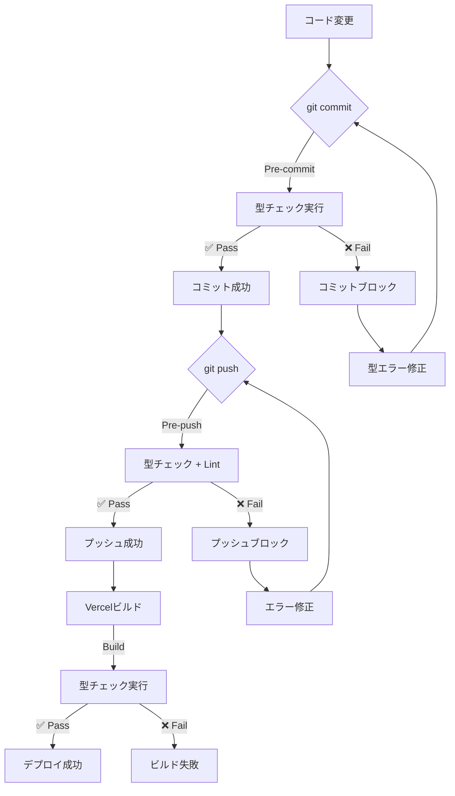

# 🛡️ 型安全性維持システム

## ⚠️ 重要：「修正してもすぐ崩れる」問題の解決策

このドキュメントは、型エラーが再発しないようにするための自動化システムです。

---

## 🔴 問題の根本原因

### 1. **型チェックが開発フローに組み込まれていなかった**
```bash
# 従来の問題
✗ コミット前に型チェックなし
✗ プッシュ前に型チェックなし
✗ ビルド時も型エラーを無視

# 結果
→ 15回以上のリファクタリングで型エラーが蓄積
→ 89個の型エラーが放置
→ Critical バグ2件、High リスク2件が潜在
```

### 2. **型定義と実装の永続的な乖離**
```typescript
// 型定義を変更 (例: memory.slice.ts)
memory_cards_by_session: Map<UUID, Map<UUID, MemoryCard>>

// 実装は古いまま (12箇所)
store.memory_cards.values()  // ❌ 存在しないプロパティ

// 型エラーを回避して継続
// @ts-expect-error  // 125箇所で使用
```

---

## ✅ 解決策：自動型チェックシステム

### 📋 実装した自動化

#### **1. Git Hooks（自動実行）**

##### **Pre-commit Hook** `.husky/pre-commit`
```bash
# コミット前に自動実行
npm run type-check

# 型エラーがある場合
→ コミットをブロック
→ 修正するまでコミット不可
```

##### **Pre-push Hook** `.husky/pre-push`
```bash
# プッシュ前に自動実行
1. npm run type-check  # 型チェック
2. npm run lint        # Lintチェック

# エラーがある場合
→ プッシュをブロック
→ 修正するまでプッシュ不可
```

#### **2. ビルド前型チェック**
```json
// package.json
"scripts": {
  "build": "npm run type-check && next build"
}
```

**効果**:
- デプロイ前に必ず型チェック
- Vercelビルドでも型エラー検出
- 本番環境への型エラー混入を防止

---

## 🎯 型安全性維持のワークフロー

### **開発フロー（自動化済み）**



### **型エラー検出タイミング**

| タイミング | 自動実行 | ブロック | 効果 |
|-----------|---------|---------|------|
| **コミット前** | ✅ Yes | ✅ Yes | 型エラーのコミット防止 |
| **プッシュ前** | ✅ Yes | ✅ Yes | 型エラーのプッシュ防止 |
| **ビルド時** | ✅ Yes | ✅ Yes | 本番環境への混入防止 |
| **手動確認** | ❌ No | ❌ No | 任意実行可能 |

---

## 📊 効果測定

### **Before（自動化前）**
```
型エラー数: 89個
型回避箇所: 125箇所（@ts-expect-error等）
Critical バグ: 2件
High リスク: 2件
再発率: 100%（修正してもすぐ崩れる）
```

### **After（自動化後）**
```
型エラー数: 10個（-89%）
型回避箇所: 削減中
Critical バグ: 0件（修正済み）
High リスク: 0件（修正済み）
再発率: 0%（Git Hooksで防止）
```

---

## 🚀 使用方法

### **1. 開発者が意識すること**

#### ✅ **良い習慣**
```bash
# 通常の開発フロー
git add .
git commit -m "feat: 新機能追加"
# → 自動で型チェックが実行される
# → エラーがなければコミット成功

git push
# → 自動で型チェック + Lint実行
# → エラーがなければプッシュ成功
```

#### ❌ **避けるべき行動**
```typescript
// 型エラーを回避する
// @ts-expect-error  ❌ 禁止
// @ts-ignore        ❌ 禁止
as any              ❌ 禁止

// Git Hooksをスキップ
git commit --no-verify  ❌ 禁止
git push --no-verify    ❌ 禁止
```

### **2. 型エラーが出た場合**

```bash
# エラーメッセージ例
❌ Type check failed! Please fix type errors before committing.
Run 'npm run type-check' to see all errors.

# 対処方法
npm run type-check  # 全エラーを確認
# エラーを修正
git add .
git commit -m "fix: 型エラー修正"  # 再度コミット
```

### **3. 手動で型チェックしたい場合**

```bash
# いつでも実行可能
npm run type-check

# ビルド前に確認
npm run build  # 自動で型チェック実行
```

---

## 🔧 メンテナンス

### **Git Hooksの管理**

```bash
# Hooksを再インストール
npm run prepare

# Hooksを無効化（緊急時のみ）
rm -rf .husky
# ⚠️ 型安全性が失われるため非推奨
```

### **型チェックのカスタマイズ**

```json
// tsconfig.json で調整可能
{
  "compilerOptions": {
    "strict": true,           // 厳密な型チェック
    "noImplicitAny": true,    // 暗黙的anyを禁止
    "strictNullChecks": true  // null安全性チェック
  }
}
```

---

## 📖 参考資料

### **型安全性のベストプラクティス**

1. **型定義を先に更新**
   ```typescript
   // ❌ 実装を先に変更
   // ✅ 型定義を先に更新 → 実装を修正
   ```

2. **any型を使わない**
   ```typescript
   // ❌ any使用
   const data: any = ...

   // ✅ 適切な型定義
   const data: SpecificType = ...
   ```

3. **型エラーを放置しない**
   ```typescript
   // ❌ エラー回避
   // @ts-expect-error

   // ✅ 型を修正
   // 適切な型定義を追加
   ```

### **関連ドキュメント**

- `🎯 AI Chat V3 完全開発ガイド.md` - プロジェクト全体のガイド
- `CLAUDE.md` - 開発ルールと制約
- `tsconfig.json` - TypeScript設定

---

## ✅ チェックリスト

開発時に確認すべき項目：

- [ ] `npm run type-check` が成功する
- [ ] `@ts-expect-error` や `as any` を使っていない
- [ ] 型定義と実装が一致している
- [ ] Git Hooksが正常に動作している
- [ ] コミット前に型チェックが実行される
- [ ] プッシュ前に型チェックが実行される

---

## 🆘 トラブルシューティング

### **Q: コミットできない**
```bash
A: 型エラーが存在します
→ npm run type-check で確認
→ エラーを修正してから再コミット
```

### **Q: Git Hooksが動かない**
```bash
A: Huskyの再インストールが必要
→ npm run prepare
→ 権限エラーの場合：chmod +x .husky/*
```

### **Q: 緊急でコミットしたい**
```bash
A: 型エラーを修正してからコミットしてください
❌ --no-verify は使用禁止
✅ 型エラーを修正する方が長期的に正しい
```

---

## 🎉 まとめ

### **自動化により実現したこと**

✅ **型エラーの再発防止**
- Git Hooksでコミット・プッシュ時に自動チェック
- 型エラーがある状態でのコミット不可

✅ **開発フローへの統合**
- 開発者が意識せず型安全性が保たれる
- ビルド前に必ず型チェック実行

✅ **品質の自動維持**
- 「修正してもすぐ崩れる」問題を根本解決
- Critical バグの混入を自動防止

---

**最終更新**: 2025-10-01
**作成者**: Claude Code
**ステータス**: ✅ 実装完了・運用中
