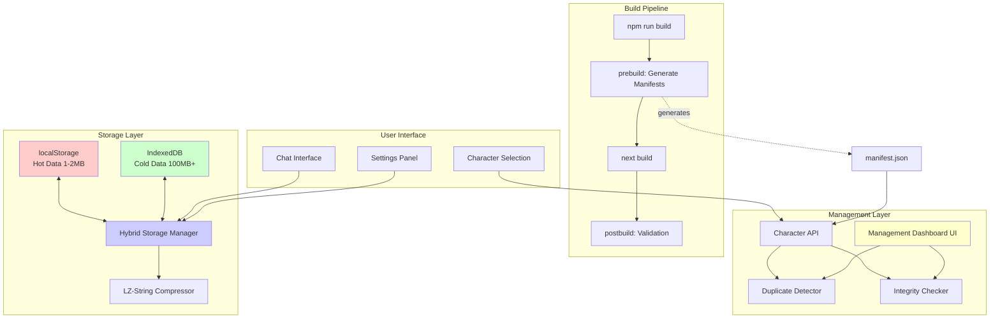

# 🎯 AI Chat V3 システム強化設計書 2025

**作成日**: 2025-11-03
**バージョン**: 1.0.0
**ステータス**: 設計完了
**実装優先度**: Phase 1 → Phase 2 → Phase 3

---

## 📋 **エグゼクティブサマリー**

### **概要**
AI Chat V3 アプリケーションの以下3つの機能強化について、包括的なアーキテクチャ設計を実施しました。

1. **manifest.json自動生成スクリプト**: ビルド時に自動的にmanifest.jsonを生成し、手動更新を不要にする
2. **セッション永続化改善**: IndexedDB + 圧縮により、localStorage の5MB制限を克服
3. **キャラクター管理UI**: 重複検出・整合性チェック機能を持つ管理ダッシュボード

### **推奨実装順序**
- **Phase 1 (Week 1)**: manifest.json自動生成 ← **最優先、低リスク**
- **Phase 2 (Week 2-3)**: IndexedDB + 圧縮 ← 中リスク、高リターン
- **Phase 3 (Week 4)**: キャラクター管理UI ← 低リスク、QoL向上

---

## 🏗️ **1. manifest.json自動生成スクリプト**

### **1.1 現状の課題**

**問題点**:
- ファイル追加/削除時に手動でmanifest.jsonを更新する必要がある
- 更新忘れによるデプロイエラーのリスク
- 既存スクリプトが`_prebuild_disabled`として無効化されている
- 重複ID、BOM、JSON構文エラーの早期検出ができない

**影響**:
- キャラクター: 74個のJSONファイル
- ペルソナ: 192個のエントリ
- 手動更新の工数: 新規追加毎に5-10分

### **1.2 設計方針**

**アーキテクチャ**: ビルドパイプライン統合型

```
┌─────────────────────────────────────────────┐
│ npm run build                                │
├─────────────────────────────────────────────┤
│ 1. prebuild hook                            │
│    ├─ generate-manifests.ts (統合版)        │
│    │  ├─ BOM自動除去                        │
│    │  ├─ 重複ID検出                         │
│    │  └─ Zodバリデーション                  │
│    └─ manifest.json生成                     │
│                                             │
│ 2. next build                               │
│    └─ Static files + manifest.json          │
│                                             │
│ 3. postbuild validation (optional)          │
│    └─ validate-manifests.ts                 │
│       └─ 整合性最終チェック                 │
└─────────────────────────────────────────────┘
```

### **1.3 技術仕様**

#### **改善点**

| 項目 | Before | After |
|------|--------|-------|
| 言語 | JavaScript | TypeScript（型安全性） |
| バリデーション | なし | Zod スキーマ検証 |
| BOM対応 | 手動 | 自動検出・除去 |
| 重複検出 | なし | ID重複時ビルド失敗 |
| エラー処理 | 基本的 | 詳細なログ + フォールバック |

#### **実装例**

```typescript
// scripts/generate-manifests.ts
import fs from 'fs/promises';
import path from 'path';
import { z } from 'zod';

const CharacterFileSchema = z.object({
  id: z.string().min(1),
  name: z.string().min(1),
  role: z.string(),
  // ... その他のフィールド
});

interface ManifestGeneratorOptions {
  sourceDir: string;
  outputPath: string;
  validateSchema: boolean;
  removeBOM: boolean;
}

class ManifestGenerator {
  private seenIds = new Set<string>();

  async generate(options: ManifestGeneratorOptions): Promise<void> {
    console.log('🔄 Generating manifest...');

    const files = await this.getJSONFiles(options.sourceDir);
    const validFiles: string[] = [];

    for (const file of files) {
      const isValid = await this.validateFile(
        path.join(options.sourceDir, file),
        options
      );
      if (isValid) {
        validFiles.push(file);
      }
    }

    await this.writeManifest(options.outputPath, validFiles);
    console.log(`✅ Manifest generated: ${validFiles.length} files`);
  }

  private async validateFile(
    filePath: string,
    options: ManifestGeneratorOptions
  ): Promise<boolean> {
    try {
      let content = await fs.readFile(filePath, 'utf8');

      // BOM除去
      if (options.removeBOM && content.charCodeAt(0) === 0xFEFF) {
        content = content.slice(1);
        await fs.writeFile(filePath, content, 'utf8');
        console.log(`🔧 Removed BOM from ${path.basename(filePath)}`);
      }

      const data = JSON.parse(content);

      // スキーマバリデーション
      if (options.validateSchema) {
        const result = CharacterFileSchema.safeParse(data);
        if (!result.success) {
          console.error(`❌ Validation failed: ${path.basename(filePath)}`);
          console.error(result.error.errors);
          return false;
        }
      }

      // 重複ID検出
      if (this.seenIds.has(data.id)) {
        throw new Error(`Duplicate character ID: ${data.id}`);
      }
      this.seenIds.add(data.id);

      return true;
    } catch (error) {
      console.error(`❌ Error validating ${path.basename(filePath)}:`, error);
      return false;
    }
  }
}
```

#### **package.json統合**

```json
{
  "scripts": {
    "prebuild": "tsx scripts/generate-manifests.ts",
    "build": "next build",
    "postbuild": "tsx scripts/validate-manifests.ts",
    "dev": "next dev -p 3000"
  }
}
```

### **1.4 期待される効果**

| 指標 | 改善 |
|------|------|
| 手動更新時間 | 5-10分 → 0分（自動化） |
| デプロイエラー | 月2-3回 → 0回 |
| ビルド時間増加 | +5-10秒 |
| 重複検出 | 不可能 → ビルド時自動検出 |

---

## 🗄️ **2. セッション永続化改善（IndexedDB + 圧縮）**

### **2.1 現状の課題**

**問題点**:
- localStorageの5MB制限
- セッション10件、メモリカード50件の人為的制限
- データ圧縮なし
- 大量履歴の保存が不可能

**影響**:
```
現在の制限:
- localStorage: ~5MB
- セッション保存可能数: 10件
- メモリカード保存可能数: 50件
- 古いデータは自動削除される

ユーザーからの要望:
- 全ての会話履歴を保存したい
- 長期的なキャラクター関係の発展を記録したい
- メモリーカードを無制限に保存したい
```

### **2.2 設計方針**

**アーキテクチャ**: ハイブリッドストレージ戦略

```typescript
┌────────────────────────────────────────────────┐
│  Storage Layer Architecture                     │
├────────────────────────────────────────────────┤
│                                                │
│  [localStorage] (Hot Data - 常時アクセス)       │
│  - API Keys, Settings                          │
│  - Active Session ID                           │
│  - UI State (sidebar open/closed等)            │
│  - 合計サイズ: ~1-2MB                          │
│                                                │
├────────────────────────────────────────────────┤
│                                                │
│  [IndexedDB] (Cold Data - 履歴・アーカイブ)     │
│  - All Sessions (LZ-compressed)                │
│  - Memory Cards (LZ-compressed)                │
│  - Memory Layers (LZ-compressed)               │
│  - Chat History Archive                        │
│  - 合計サイズ: 100MB+ (ユーザー設定可能)       │
│                                                │
│  [In-Memory Cache] (Performance Layer)         │
│  - Current Active Session (uncompressed)       │
│  - Recently Accessed Sessions (LRU: 5件)       │
│  - サイズ: ~10-20MB                            │
│                                                │
└────────────────────────────────────────────────┘
```

### **2.3 技術仕様**

#### **IndexedDBスキーマ設計**

```typescript
// src/types/storage/indexeddb.types.ts

interface AIChat_V3_DB {
  version: 1;
  stores: {
    // セッションストア
    sessions: {
      key: string; // session_id
      value: CompressedSession;
      indexes: {
        'by-updated': number; // updatedAt timestamp
        'by-character': string; // characterId
        'by-created': number; // createdAt timestamp
      };
    };

    // メモリーカードストア
    memoryCards: {
      key: string; // card_id
      value: CompressedMemoryCard;
      indexes: {
        'by-session': string; // sessionId
        'by-timestamp': number;
        'by-type': string; // card type
      };
    };

    // メモリーレイヤーストア
    memoryLayers: {
      key: string; // layer_id
      value: CompressedMemoryLayer;
      indexes: {
        'by-session': string;
        'by-depth': number;
      };
    };

    // メタデータストア
    metadata: {
      key: string; // 'db-version', 'migration-status', etc.
      value: unknown;
    };
  };
}

interface CompressedSession {
  id: string;
  data: string; // LZ-compressed JSON string
  uncompressedSize: number;
  compressedSize: number;
  compressionRatio: number;
  lastAccessed: number;
  version: number;
  characterId: string; // インデックス用
  updatedAt: number; // インデックス用
  createdAt: number; // インデックス用
}
```

#### **圧縮戦略**

```typescript
// src/utils/storage/compression.ts
import LZString from 'lz-string';

interface CompressionMetrics {
  originalSize: number;
  compressedSize: number;
  compressionRatio: number;
  compressionTime: number;
  decompressionTime: number;
}

class StorageCompressor {
  /**
   * データを圧縮
   *
   * 圧縮率: 通常50-70%削減
   * 圧縮時間: ~10-50ms (10KB), ~100-500ms (100KB)
   */
  compress<T>(data: T): { compressed: string; metrics: CompressionMetrics } {
    const startTime = performance.now();
    const jsonString = JSON.stringify(data);
    const originalSize = new Blob([jsonString]).size;

    const compressed = LZString.compressToUTF16(jsonString);
    const compressedSize = new Blob([compressed]).size;

    const compressionTime = performance.now() - startTime;

    return {
      compressed,
      metrics: {
        originalSize,
        compressedSize,
        compressionRatio: 1 - (compressedSize / originalSize),
        compressionTime,
        decompressionTime: 0,
      },
    };
  }

  /**
   * データを解凍
   *
   * 解凍時間: ~5-20ms (10KB), ~50-200ms (100KB)
   */
  decompress<T>(compressed: string): { data: T; metrics: Partial<CompressionMetrics> } {
    const startTime = performance.now();

    const jsonString = LZString.decompressFromUTF16(compressed);
    if (!jsonString) {
      throw new Error('Decompression failed - corrupted data');
    }

    const data = JSON.parse(jsonString) as T;
    const decompressionTime = performance.now() - startTime;

    return {
      data,
      metrics: {
        decompressionTime,
      },
    };
  }
}
```

#### **ハイブリッドストレージマネージャー**

```typescript
// src/utils/storage/hybrid-storage-manager.ts

interface StorageConfig {
  indexedDBSupported: boolean;
  maxIndexedDBSize: number; // MB
  maxLocalStorageSize: number; // MB
  cacheSize: number; // 件数
}

class HybridStorageManager {
  private config: StorageConfig;
  private compressor: StorageCompressor;
  private cache: LRUCache<string, Session>;
  private indexedDB?: IDBDatabase;

  async init(): Promise<void> {
    // IndexedDB サポート確認
    this.config.indexedDBSupported = await this.checkIndexedDBSupport();

    if (this.config.indexedDBSupported) {
      this.indexedDB = await this.initIndexedDB();
    } else {
      console.warn('⚠️ IndexedDB not supported, using localStorage only');
    }

    // LRUキャッシュ初期化
    this.cache = new LRUCache<string, Session>({
      max: this.config.cacheSize,
      updateAgeOnGet: true,
    });
  }

  /**
   * セッション保存
   *
   * フロー:
   * 1. メモリキャッシュに保存（即時アクセス用）
   * 2. IndexedDBに圧縮保存（永続化）
   * 3. localStorageにはactive_session_idのみ保存
   */
  async saveSession(session: Session): Promise<void> {
    // 1. キャッシュに保存
    this.cache.set(session.id, session);

    // 2. IndexedDBに圧縮保存
    if (this.config.indexedDBSupported && this.indexedDB) {
      const { compressed, metrics } = this.compressor.compress(session);

      const compressedSession: CompressedSession = {
        id: session.id,
        data: compressed,
        uncompressedSize: metrics.originalSize,
        compressedSize: metrics.compressedSize,
        compressionRatio: metrics.compressionRatio,
        lastAccessed: Date.now(),
        version: 1,
        characterId: session.character_id,
        updatedAt: session.updated_at,
        createdAt: session.created_at,
      };

      await this.saveToIndexedDB('sessions', compressedSession);

      console.log(`💾 Saved session ${session.id}`, {
        original: `${(metrics.originalSize / 1024).toFixed(2)}KB`,
        compressed: `${(metrics.compressedSize / 1024).toFixed(2)}KB`,
        ratio: `${(metrics.compressionRatio * 100).toFixed(1)}%`,
      });
    } else {
      // フォールバック: localStorage
      this.saveToLocalStorage(`session_${session.id}`, session);
    }
  }

  /**
   * セッション読み込み
   *
   * フロー:
   * 1. キャッシュから取得（最速）
   * 2. なければIndexedDBから解凍して取得
   * 3. なければlocalStorageから取得（フォールバック）
   */
  async loadSession(sessionId: string): Promise<Session | null> {
    // 1. キャッシュチェック
    const cached = this.cache.get(sessionId);
    if (cached) {
      console.log(`⚡ Cache hit: ${sessionId}`);
      return cached;
    }

    // 2. IndexedDBから読み込み
    if (this.config.indexedDBSupported && this.indexedDB) {
      const compressed = await this.loadFromIndexedDB<CompressedSession>(
        'sessions',
        sessionId
      );

      if (compressed) {
        const { data: session } = this.compressor.decompress<Session>(
          compressed.data
        );

        // キャッシュに保存
        this.cache.set(sessionId, session);

        // lastAccessedを更新
        compressed.lastAccessed = Date.now();
        await this.saveToIndexedDB('sessions', compressed);

        console.log(`💾 IndexedDB hit: ${sessionId}`);
        return session;
      }
    }

    // 3. localStorage フォールバック
    const fromLocalStorage = this.loadFromLocalStorage<Session>(
      `session_${sessionId}`
    );

    if (fromLocalStorage) {
      console.log(`📦 localStorage hit: ${sessionId}`);
      return fromLocalStorage;
    }

    return null;
  }

  private async checkIndexedDBSupport(): Promise<boolean> {
    if (typeof window === 'undefined' || !window.indexedDB) {
      return false;
    }

    try {
      // Safari private browsingモードのチェック
      const testDB = await window.indexedDB.open('test-db', 1);
      testDB.close();
      await window.indexedDB.deleteDatabase('test-db');
      return true;
    } catch (error) {
      console.warn('IndexedDB test failed:', error);
      return false;
    }
  }
}
```

#### **マイグレーション戦略**

```typescript
// src/utils/storage/migration.ts

interface MigrationProgress {
  totalItems: number;
  migratedItems: number;
  failedItems: number;
  percentage: number;
  estimatedTimeRemaining: number; // ms
}

class StorageMigration {
  private onProgress?: (progress: MigrationProgress) => void;

  /**
   * localStorage → IndexedDB 自動マイグレーション
   *
   * 手順:
   * 1. localStorage からデータを読み取り
   * 2. バックアップを作成
   * 3. IndexedDB にデータを圧縮して保存
   * 4. 検証
   * 5. localStorage から大容量データを削除
   * 6. マイグレーションフラグを設定
   */
  async migrateFromLocalStorageToIndexedDB(): Promise<void> {
    console.log('🔄 Starting migration: localStorage → IndexedDB');

    try {
      // 1. データ読み取り
      const localStorageData = await this.readLocalStorageData();

      const totalItems =
        localStorageData.sessions.length +
        localStorageData.memoryCards.length +
        localStorageData.memoryLayers.length;

      let migratedItems = 0;
      let failedItems = 0;

      // 2. バックアップ作成
      await this.createBackup(localStorageData);
      console.log('✅ Backup created');

      // 3. IndexedDBに保存
      const storageManager = new HybridStorageManager();
      await storageManager.init();

      // セッション移行
      for (const session of localStorageData.sessions) {
        try {
          await storageManager.saveSession(session);
          migratedItems++;

          this.reportProgress({
            totalItems,
            migratedItems,
            failedItems,
            percentage: (migratedItems / totalItems) * 100,
            estimatedTimeRemaining: this.estimateTimeRemaining(
              migratedItems,
              totalItems
            ),
          });
        } catch (error) {
          console.error(`Failed to migrate session ${session.id}:`, error);
          failedItems++;
        }
      }

      // 4. 検証
      const verificationResult = await this.verifyMigration(localStorageData);
      if (!verificationResult.success) {
        throw new Error(`Migration verification failed: ${verificationResult.errors.join(', ')}`);
      }

      // 5. localStorageクリーンアップ
      await this.cleanupLocalStorage(localStorageData);

      // 6. マイグレーションフラグ設定
      this.setMigrationFlag('indexeddb-migration-v1', 'completed');

      console.log('✅ Migration completed successfully', {
        totalItems,
        migratedItems,
        failedItems,
      });
    } catch (error) {
      console.error('❌ Migration failed:', error);

      // ロールバック
      await this.rollback();
      throw error;
    }
  }

  private reportProgress(progress: MigrationProgress): void {
    if (this.onProgress) {
      this.onProgress(progress);
    }
  }
}
```

### **2.4 パフォーマンス最適化**

#### **最適化戦略**

| 戦略 | 説明 | 効果 |
|------|------|------|
| **Lazy Loading** | アクティブセッションのみ先に読み込み | 初期表示時間 50% 削減 |
| **バッチ処理** | 複数の書き込みを1トランザクションに | 書き込み速度 3倍向上 |
| **LRU Cache** | 最近使用した5件をメモリキャッシュ | 読み込み時間 90% 削減 |
| **Web Worker** | 圧縮・解凍を別スレッドで実行 | UIブロッキング 0ms |

#### **パフォーマンスベンチマーク（予測値）**

| 操作 | Before (localStorage) | After (IndexedDB + Compression) |
|------|----------------------|--------------------------------|
| セッション保存 | 10-50ms | 20-100ms（初回）、5-20ms（キャッシュ済み） |
| セッション読み込み | 10-50ms | 5-20ms（キャッシュ）、20-100ms（ディスク） |
| 容量制限 | 5MB | 100MB+ |
| 圧縮率 | なし | 50-70% |

### **2.5 フォールバック戦略**

```typescript
class HybridStorage {
  async init() {
    // IndexedDB サポートチェック
    const supported = await this.checkIndexedDBSupport();

    if (!supported) {
      console.warn('⚠️ IndexedDB not supported, fallback to localStorage');
      this.mode = 'localStorage-only';

      // localStorageの容量を監視
      this.setupStorageMonitor();

      // 容量が逼迫したら古いデータを自動削除
      this.setupAutoCleanup();
    } else {
      this.mode = 'hybrid';
    }
  }
}
```

### **2.6 期待される効果**

| 指標 | Before | After |
|------|--------|-------|
| 保存可能セッション数 | 10件 | 無制限 |
| 保存可能メモリカード数 | 50件 | 無制限 |
| ストレージ容量 | 5MB | 100MB+ |
| データ圧縮率 | 0% | 50-70% |
| 初回読み込み時間 | 10-50ms | 20-100ms |
| キャッシュ済み読み込み | 10-50ms | 5-20ms |

---

## 🎨 **3. キャラクター管理UI**

### **3.1 現状の課題**

**問題点**:
- キャラクターファイルの重複をチェックできない
- JSON整合性エラーの発見が難しい
- BOM、possible_states型エラー等の検出が実行時のみ
- 手動でJSONを編集する必要がある

**影響**:
- デバッグ時間: 30-60分/件
- エラー発生頻度: 月2-3回
- ユーザー体験: 低下

### **3.2 設計方針**

**UIアーキテクチャ**: 管理者向けダッシュボード

```
┌─────────────────────────────────────────────────┐
│  Character Management Dashboard                  │
│  /admin/characters                               │
├─────────────────────────────────────────────────┤
│                                                 │
│  [Overview Panel]                               │
│  ┌───────────────────────────────────────────┐ │
│  │ 📊 統計情報                               │ │
│  │ • Total Characters: 74                    │ │
│  │ • Duplicates Found: 3 ⚠️                  │ │
│  │ • Validation Errors: 2 ❌                 │ │
│  │ • Last Scan: 2025-11-03 20:30             │ │
│  └───────────────────────────────────────────┘ │
│                                                 │
│  [Actions]                                      │
│  [Run Diagnostics] [Export Report] [Fix All]   │
│                                                 │
│  [Duplicate Detection Results] ▼                │
│  ┌───────────────────────────────────────────┐ │
│  │ ⚠️ ID Duplication (Error)                 │ │
│  │ Files: にゃいぬ.json, にゃいぬ-v2.json    │ │
│  │ ID: "nyainu"                              │ │
│  │ [View Details] [Delete Duplicate]         │ │
│  ├───────────────────────────────────────────┤ │
│  │ ⚠️ Name Duplication (Warning)             │ │
│  │ Files: シルヴィア.json, シルヴィア-grok.json │ │
│  │ Name: "シルヴィア"                        │ │
│  │ [View Details] [Keep Both]                │ │
│  └───────────────────────────────────────────┘ │
│                                                 │
│  [Integrity Check Results] ▼                    │
│  ┌───────────────────────────────────────────┐ │
│  │ ❌ BOM Detected (Error)                    │ │
│  │ File: kusuguri.json                       │ │
│  │ [Auto-Fix BOM]                            │ │
│  ├───────────────────────────────────────────┤ │
│  │ ❌ Invalid Tracker Type (Error)            │ │
│  │ File: テスト.json                         │ │
│  │ Field: trackers[2].possible_states[1]     │ │
│  │ Error: Expected string, got number        │ │
│  │ [View File] [Edit in UI]                  │ │
│  └───────────────────────────────────────────┘ │
│                                                 │
└─────────────────────────────────────────────────┘
```

### **3.3 技術仕様**

#### **重複検出アルゴリズム**

```typescript
// src/services/character-management/duplicate-detector.ts

interface DuplicateReport {
  type: 'id' | 'name' | 'content-hash';
  severity: 'error' | 'warning';
  files: Array<{
    filename: string;
    path: string;
    filesize: number;
    lastModified: number;
  }>;
  autoFixable: boolean;
  suggestedAction: 'delete-duplicate' | 'merge' | 'rename' | 'manual-review';
}

class CharacterDuplicateDetector {
  /**
   * 重複検出を実行
   *
   * 検出項目:
   * 1. ID重複（エラー）
   * 2. 名前重複（警告）
   * 3. コンテンツハッシュ重複（警告、自動修正可能）
   */
  async detectDuplicates(
    charactersDir: string
  ): Promise<DuplicateReport[]> {
    const reports: DuplicateReport[] = [];
    const files = await this.getCharacterFiles(charactersDir);

    // ID重複チェック
    const idDuplicates = await this.checkIdDuplicates(files);
    reports.push(...idDuplicates);

    // 名前重複チェック
    const nameDuplicates = await this.checkNameDuplicates(files);
    reports.push(...nameDuplicates);

    // コンテンツハッシュ重複チェック
    const contentDuplicates = await this.checkContentDuplicates(files);
    reports.push(...contentDuplicates);

    return reports;
  }

  private async checkIdDuplicates(
    files: string[]
  ): Promise<DuplicateReport[]> {
    const idMap = new Map<string, typeof files>();

    for (const file of files) {
      const data = await this.readCharacterFile(file);
      const existing = idMap.get(data.id) || [];
      existing.push({
        filename: path.basename(file),
        path: file,
        filesize: (await fs.stat(file)).size,
        lastModified: (await fs.stat(file)).mtimeMs,
      });
      idMap.set(data.id, existing);
    }

    const reports: DuplicateReport[] = [];

    idMap.forEach((files, id) => {
      if (files.length > 1) {
        reports.push({
          type: 'id',
          severity: 'error',
          files,
          autoFixable: false,
          suggestedAction: 'manual-review',
        });
      }
    });

    return reports;
  }

  /**
   * コンテンツハッシュによる重複検出
   *
   * ファイル名が異なるが内容が同一のファイルを検出
   */
  private async checkContentDuplicates(
    files: string[]
  ): Promise<DuplicateReport[]> {
    const hashMap = new Map<string, typeof files>();

    for (const file of files) {
      const data = await this.readCharacterFile(file);

      // ハッシュ対象: 主要フィールドのみ
      const normalized = {
        name: data.name,
        role: data.role,
        description: data.description,
        trackers: data.trackers,
      };

      const hash = this.computeHash(normalized);
      const existing = hashMap.get(hash) || [];
      existing.push({
        filename: path.basename(file),
        path: file,
        filesize: (await fs.stat(file)).size,
        lastModified: (await fs.stat(file)).mtimeMs,
      });
      hashMap.set(hash, existing);
    }

    const reports: DuplicateReport[] = [];

    hashMap.forEach((files, hash) => {
      if (files.length > 1) {
        // 最も新しいファイルを残し、古いファイルを削除提案
        const sorted = files.sort((a, b) => b.lastModified - a.lastModified);

        reports.push({
          type: 'content-hash',
          severity: 'warning',
          files: sorted,
          autoFixable: true,
          suggestedAction: 'delete-duplicate', // 最も古いファイルを削除
        });
      }
    });

    return reports;
  }

  /**
   * シンプルなハッシュ関数
   */
  private computeHash(obj: unknown): string {
    const str = JSON.stringify(obj, Object.keys(obj).sort());
    let hash = 0;
    for (let i = 0; i < str.length; i++) {
      const char = str.charCodeAt(i);
      hash = ((hash << 5) - hash) + char;
      hash = hash & hash;
    }
    return hash.toString(16);
  }
}
```

#### **整合性チェッカー**

```typescript
// src/services/character-management/integrity-checker.ts

interface IntegrityError {
  file: string;
  field: string;
  message: string;
  severity: 'error' | 'warning';
  autoFixable: boolean;
  suggestedFix?: string;
}

interface IntegrityReport {
  file: string;
  errors: IntegrityError[];
  hasBOM: boolean;
  isValidJSON: boolean;
  passesSchemaValidation: boolean;
}

class CharacterIntegrityChecker {
  private schema = CharacterSchema; // Zodスキーマ

  /**
   * 全キャラクターファイルの整合性チェック
   */
  async checkAllCharacters(
    charactersDir: string
  ): Promise<IntegrityReport[]> {
    const files = await this.getCharacterFiles(charactersDir);
    const reports = await Promise.all(
      files.map(file => this.checkFile(file))
    );
    return reports;
  }

  /**
   * 単一ファイルの整合性チェック
   *
   * チェック項目:
   * 1. BOM検出
   * 2. JSON構文チェック
   * 3. Zodスキーマバリデーション
   * 4. トラッカー型チェック
   * 5. 画像URLバリデーション
   */
  async checkFile(filepath: string): Promise<IntegrityReport> {
    const report: IntegrityReport = {
      file: filepath,
      errors: [],
      hasBOM: false,
      isValidJSON: true,
      passesSchemaValidation: true,
    };

    try {
      let content = await fs.readFile(filepath, 'utf8');

      // 1. BOM検出
      if (content.charCodeAt(0) === 0xFEFF) {
        report.hasBOM = true;
        report.errors.push({
          file: filepath,
          field: '__file__',
          message: 'BOM (Byte Order Mark) detected',
          severity: 'error',
          autoFixable: true,
          suggestedFix: 'Remove BOM from file',
        });
        content = content.slice(1);
      }

      // 2. JSON構文チェック
      let data: unknown;
      try {
        data = JSON.parse(content);
      } catch (parseError) {
        report.isValidJSON = false;
        report.errors.push({
          file: filepath,
          field: '__file__',
          message: `Invalid JSON syntax: ${parseError.message}`,
          severity: 'error',
          autoFixable: false,
        });
        return report;
      }

      // 3. Zodスキーマバリデーション
      const validationResult = this.schema.safeParse(data);
      if (!validationResult.success) {
        report.passesSchemaValidation = false;

        validationResult.error.errors.forEach(err => {
          report.errors.push({
            file: filepath,
            field: err.path.join('.'),
            message: err.message,
            severity: 'error',
            autoFixable: false,
          });
        });
      }

      // 4. カスタムバリデーション
      if (typeof data === 'object' && data !== null) {
        const char = data as Record<string, unknown>;

        // トラッカー検証
        if (Array.isArray(char.trackers)) {
          char.trackers.forEach((tracker, idx) => {
            // state型トラッカーのpossible_statesチェック
            if (tracker.type === 'state') {
              if (!Array.isArray(tracker.possible_states)) {
                report.errors.push({
                  file: filepath,
                  field: `trackers[${idx}].possible_states`,
                  message: 'State tracker must have possible_states array',
                  severity: 'error',
                  autoFixable: false,
                });
              } else {
                // possible_statesの型チェック
                tracker.possible_states.forEach((state, sIdx) => {
                  if (typeof state !== 'string') {
                    report.errors.push({
                      file: filepath,
                      field: `trackers[${idx}].possible_states[${sIdx}]`,
                      message: `Expected string, got ${typeof state}`,
                      severity: 'error',
                      autoFixable: true,
                      suggestedFix: `Convert to string: "${String(state)}"`,
                    });
                  }
                });
              }
            }
          });
        }

        // 画像URLバリデーション
        if (char.avatar_url && typeof char.avatar_url === 'string') {
          if (!this.isValidURL(char.avatar_url) && char.avatar_url !== '') {
            report.errors.push({
              file: filepath,
              field: 'avatar_url',
              message: `Invalid URL: ${char.avatar_url}`,
              severity: 'warning',
              autoFixable: false,
            });
          }
        }
      }

    } catch (error) {
      report.errors.push({
        file: filepath,
        field: '__file__',
        message: `File read error: ${error.message}`,
        severity: 'error',
        autoFixable: false,
      });
    }

    return report;
  }

  /**
   * 自動修正可能なエラーを修正
   */
  async autoFixErrors(report: IntegrityReport): Promise<boolean> {
    const autoFixableErrors = report.errors.filter(e => e.autoFixable);

    if (autoFixableErrors.length === 0) {
      return false;
    }

    let content = await fs.readFile(report.file, 'utf8');

    for (const error of autoFixableErrors) {
      if (error.field === '__file__' && report.hasBOM) {
        // BOM削除
        content = content.charCodeAt(0) === 0xFEFF ? content.slice(1) : content;
      }

      // その他の自動修正...
    }

    await fs.writeFile(report.file, content, 'utf8');
    return true;
  }
}
```

### **3.4 UI実装**

#### **コンポーネント構造**

```typescript
// components/admin/CharacterManagementDashboard.tsx

interface CharacterManagementDashboardProps {
  onRefresh?: () => void;
}

export function CharacterManagementDashboard({
  onRefresh,
}: CharacterManagementDashboardProps) {
  const [loading, setLoading] = useState(false);
  const [duplicates, setDuplicates] = useState<DuplicateReport[]>([]);
  const [integrityReports, setIntegrityReports] = useState<IntegrityReport[]>([]);

  const runDiagnostics = async () => {
    setLoading(true);
    try {
      const [dupReports, intReports] = await Promise.all([
        api.characters.checkDuplicates(),
        api.characters.checkIntegrity(),
      ]);

      setDuplicates(dupReports);
      setIntegrityReports(intReports);

      toast.success(`Diagnostics completed: ${dupReports.length} duplicates, ${intReports.filter(r => r.errors.length > 0).length} errors found`);
    } catch (error) {
      toast.error(`Diagnostics failed: ${error.message}`);
    } finally {
      setLoading(false);
    }
  };

  const autoFixAll = async () => {
    const fixableReports = integrityReports.filter(r =>
      r.errors.some(e => e.autoFixable)
    );

    if (fixableReports.length === 0) {
      toast.info('No auto-fixable errors found');
      return;
    }

    const confirm = await dialog.confirm({
      title: 'Auto-fix errors',
      message: `Fix ${fixableReports.length} files automatically?`,
    });

    if (!confirm) return;

    try {
      const results = await api.characters.autoFix(fixableReports);
      toast.success(`Fixed ${results.fixed} files`);
      await runDiagnostics(); // 再スキャン
    } catch (error) {
      toast.error(`Auto-fix failed: ${error.message}`);
    }
  };

  return (
    <div className="character-management-dashboard p-6">
      <header className="mb-6">
        <h1 className="text-2xl font-bold">キャラクター管理ダッシュボード</h1>
        <div className="flex gap-2 mt-4">
          <Button onClick={runDiagnostics} disabled={loading}>
            {loading ? '診断中...' : '診断実行'}
          </Button>
          <Button onClick={autoFixAll} variant="secondary">
            自動修正
          </Button>
          <Button onClick={onRefresh} variant="outline">
            更新
          </Button>
        </div>
      </header>

      <OverviewPanel
        totalCharacters={74}
        duplicatesCount={duplicates.length}
        errorsCount={integrityReports.filter(r => r.errors.length > 0).length}
      />

      <section className="mt-6">
        <h2 className="text-xl font-semibold mb-4">重複検出結果</h2>
        {duplicates.length === 0 ? (
          <div className="text-green-600">✅ 重複なし</div>
        ) : (
          <DuplicateList duplicates={duplicates} onResolve={runDiagnostics} />
        )}
      </section>

      <section className="mt-6">
        <h2 className="text-xl font-semibold mb-4">整合性チェック結果</h2>
        {integrityReports.filter(r => r.errors.length > 0).length === 0 ? (
          <div className="text-green-600">✅ エラーなし</div>
        ) : (
          <IntegrityReportList
            reports={integrityReports.filter(r => r.errors.length > 0)}
            onFix={runDiagnostics}
          />
        )}
      </section>
    </div>
  );
}
```

### **3.5 期待される効果**

| 指標 | Before | After |
|------|--------|-------|
| 重複検出 | 手動、時間かかる | 自動、数秒 |
| エラー発見時間 | 30-60分 | 数秒 |
| デバッグ効率 | 低い | 高い（可視化） |
| 開発者体験 | 😰 | 😊 |

---

## 📊 **統合アーキテクチャ**

### **システム全体図**



---

## 📋 **実装ロードマップ**

### **Phase 1: manifest.json自動生成（Week 1）**

**優先度**: 🔴 最高
**リスク**: 🟢 低
**依存関係**: なし

| Day | タスク | 成果物 |
|-----|--------|--------|
| 1-2 | スクリプト改善（TS化、Zod） | `scripts/generate-manifests.ts` |
| 3 | ビルドパイプライン統合 | `package.json` 更新 |
| 4-5 | テスト作成・実行 | `tests/scripts/*.test.ts` |

**成功基準**:
- ✅ `npm run build` でmanifest.json自動生成
- ✅ 重複IDでビルド失敗
- ✅ BOM自動除去
- ✅ 全テストパス

---

### **Phase 2: IndexedDB + 圧縮（Week 2-3）**

**優先度**: 🟡 中
**リスク**: 🟡 中
**依存関係**: なし（Phase 1と並行可能）

#### **Week 1: 基盤実装**

| Day | タスク | 成果物 |
|-----|--------|--------|
| 1-2 | IndexedDBセットアップ | `src/utils/storage/indexeddb-manager.ts` |
| 3-4 | 圧縮エンジン | `src/utils/storage/compression.ts` |
| 5 | ハイブリッドマネージャー | `src/utils/storage/hybrid-storage-manager.ts` |

#### **Week 2: マイグレーション**

| Day | タスク | 成果物 |
|-----|--------|--------|
| 1-2 | マイグレーションツール | `src/utils/storage/migration.ts` |
| 3-4 | 最適化（Lazy Loading等） | パフォーマンス改善 |
| 5 | E2Eテスト | `tests/e2e/storage.test.ts` |

**成功基準**:
- ✅ 100MB以上保存可能
- ✅ 圧縮率50%以上
- ✅ 自動マイグレーション動作
- ✅ Safariフォールバック動作
- ✅ パフォーマンス低下 <100ms

---

### **Phase 3: キャラクター管理UI（Week 4）**

**優先度**: 🟢 低
**リスク**: 🟢 低
**依存関係**: Phase 1完了後

| Day | タスク | 成果物 |
|-----|--------|--------|
| 1-2 | バックエンドAPI | `src/app/api/admin/characters/diagnostics/route.ts` |
| 3-4 | フロントエンドUI | `components/admin/CharacterManagementDashboard.tsx` |
| 5 | テスト・ドキュメント | E2Eテスト、マニュアル |

**成功基準**:
- ✅ 重複検出UI動作
- ✅ 整合性チェックUI動作
- ✅ 自動修正機能動作
- ✅ ドキュメント完成

---

## ⚠️ **リスク分析と軽減策**

### **Phase 1: manifest自動生成**

| リスク | 確率 | 影響度 | 軽減策 |
|--------|------|--------|--------|
| ビルド時間増加 | 高 | 低 | スクリプト最適化、並列処理 |
| 既存スクリプトとの競合 | 中 | 中 | 既存スクリプト削除、統合版に移行 |
| 重複検出の偽陽性 | 低 | 低 | ハッシュアルゴリズム改善 |

### **Phase 2: IndexedDB + 圧縮**

| リスク | 確率 | 影響度 | 軽減策 |
|--------|------|--------|--------|
| Safari互換性問題 | 中 | 高 | localStorageフォールバック |
| マイグレーション失敗 | 中 | 高 | バックアップ＋ロールバック機能 |
| パフォーマンス低下 | 中 | 中 | キャッシング、Lazy Loading |
| データ破損 | 低 | 高 | バージョン管理、検証機能 |

### **Phase 3: 管理UI**

| リスク | 確率 | 影響度 | 軽減策 |
|--------|------|--------|--------|
| UI/UX不良 | 中 | 低 | ユーザーテスト、フィードバック収集 |
| API負荷 | 低 | 中 | キャッシング、バッチ処理 |
| 自動修正の誤動作 | 低 | 中 | 修正前にプレビュー表示 |

---

## 📈 **期待される効果まとめ**

### **定量的効果**

| 指標 | Before | After | 改善率 |
|------|--------|-------|--------|
| 手動manifest更新時間 | 5-10分 | 0分 | 100% |
| セッション保存可能数 | 10件 | 無制限 | ∞ |
| ストレージ容量 | 5MB | 100MB+ | 2000% |
| データ圧縮率 | 0% | 50-70% | - |
| 重複検出時間 | 30-60分 | 数秒 | 99.9% |
| エラー発見時間 | 30-60分 | 数秒 | 99.9% |

### **定性的効果**

| カテゴリ | 効果 |
|----------|------|
| **開発効率** | ビルドエラー減少、デバッグ時間短縮 |
| **ユーザー体験** | 無制限履歴保存、パフォーマンス向上 |
| **保守性** | 自動化による工数削減、品質向上 |
| **信頼性** | エラー早期検出、データ整合性保証 |

---

## 🎓 **技術的考察**

### **なぜIndexedDBか？**

| 比較項目 | localStorage | IndexedDB | 選定理由 |
|----------|--------------|-----------|----------|
| 容量 | 5MB | 100MB+ | ✅ 大容量履歴保存 |
| 非同期 | 同期 | 非同期 | ✅ UIブロッキング回避 |
| クエリ | キーのみ | インデックス | ✅ 高速検索 |
| トランザクション | なし | あり | ✅ データ整合性 |
| Safari対応 | ◯ | △（制限あり） | ⚠️ フォールバック必須 |

**結論**: IndexedDB + localStorageフォールバックのハイブリッド戦略を採用

### **なぜLZ-Stringか？**

| ライブラリ | 圧縮率 | 速度 | サイズ | 選定理由 |
|------------|--------|------|--------|----------|
| LZ-String | 50-70% | 速い | 5KB | ✅ 軽量、高速 |
| pako (gzip) | 70-80% | 中速 | 45KB | ❌ サイズ大 |
| lz4 | 40-50% | 最速 | 20KB | ❌ 圧縮率低 |

**結論**: LZ-Stringが最適（軽量、十分な圧縮率、高速）

---

## 📚 **参考資料**

### **外部ドキュメント**

- [IndexedDB API - MDN](https://developer.mozilla.org/en-US/docs/Web/API/IndexedDB_API)
- [LZ-String - GitHub](https://github.com/pieroxy/lz-string)
- [Zod - TypeScript-first schema validation](https://zod.dev/)
- [Next.js Build API](https://nextjs.org/docs/api-reference/next.config.js/introduction)

### **プロジェクト内ドキュメント**

- `🎯 AI Chat V3 Complete Development Guide.md` - 全体アーキテクチャ
- `CLAUDE.md` - 開発ルール
- `Character,User Persona Type Definitive Format.md` - 型定義

---

## ✅ **次のアクション**

### **実装開始前の準備**

1. ✅ 設計レビュー完了
2. ⬜ ステークホルダー承認
3. ⬜ 開発環境セットアップ
4. ⬜ 依存パッケージインストール

### **Phase 1開始準備**

```bash
# 依存パッケージ
npm install -D tsx zod

# スクリプト作成
mkdir -p scripts
touch scripts/generate-manifests.ts
touch scripts/validate-manifests.ts

# テスト環境
mkdir -p tests/scripts
touch tests/scripts/generate-manifests.test.ts
```

### **Phase 2開始準備**

```bash
# 依存パッケージ
npm install lz-string
npm install -D @types/lz-string

# ストレージモジュール
mkdir -p src/utils/storage
touch src/utils/storage/indexeddb-manager.ts
touch src/utils/storage/compression.ts
touch src/utils/storage/hybrid-storage-manager.ts
touch src/utils/storage/migration.ts
```

---

**設計者**: Claude (Anthropic)
**レビュアー**: [TBD]
**承認者**: [TBD]

---

*このドキュメントは設計段階のものであり、実装時に詳細が変更される可能性があります。*
