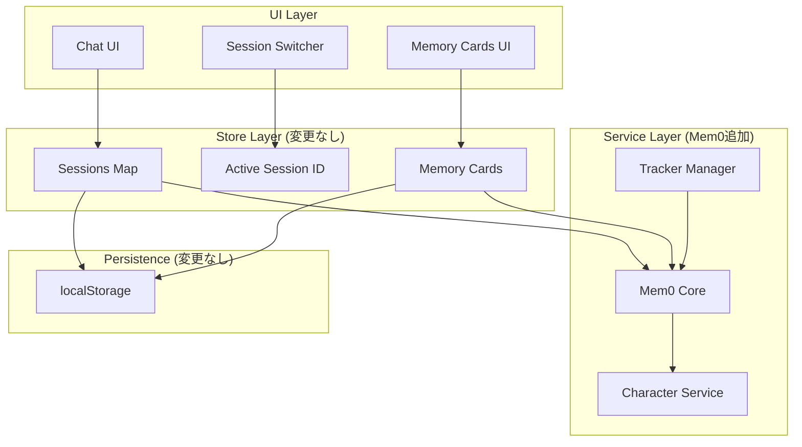

# 📊 Mem0統合 最終評価レポート

## 作成日: 2025-09-20
## 評価結果: ✅ **統合可能（段階的実装推奨）**

---

## 🎯 調査項目と評価結果

### 1. **履歴の永続化システム** ✅ 対応可能

#### 現状
```typescript
// src/store/index.ts
partialize: (state) => ({
  sessions: state.sessions,        // セッション毎の履歴
  memory_cards: state.memory_cards, // メモリーカード
  trackerManagers: state.trackerManagers, // トラッカー
})
```

#### Mem0統合後
- **セッション履歴**: そのまま維持（短期記憶として）
- **メモリーカード**: Mem0に統合（長期記憶として）
- **トラッカー**: 独立維持（キャラクター毎に管理）

**判定**: セッション切り替えは現行通り動作可能

---

### 2. **セッション切り替え機能** ✅ 影響なし

#### 現在の動作
```
セッション切替 → active_session_id変更 → 該当セッションのデータロード
```

#### Mem0統合での動作
```
セッション切替 → active_session_id変更 → 該当セッションのデータロード
                                      ↓
                              Mem0から関連記憶を取得
```

**キーポイント**:
- セッションIDベースの管理は維持
- Mem0はセッションIDを使って関連記憶を検索
- **既存のセッション切り替えUIに変更不要**

---

### 3. **インスピレーション機能** ✅ 改善される

#### 現状の問題点
```typescript
// 最新3メッセージのみ使用（制限あり）
const recentMessages = messages.slice(-3);
```

#### Mem0統合のメリット
```typescript
// Mem0から関連性の高い記憶も取得
const context = await Mem0.search(userInput);
const enrichedContext = [...recentMessages, ...context];
```

**改善点**:
- より豊富なコンテキストで提案生成
- 長期的な文脈を考慮した提案が可能
- **トークン効率的に関連情報を取得**

---

### 4. **トラッカーシステムとの共存** ✅ 完全互換

#### アーキテクチャ
```yaml
トラッカー（独立維持）:
  - キャラクターIDで管理
  - リアルタイム更新
  - 数値/状態の確実な追跡

Mem0（新規追加）:
  - セッション横断的な記憶管理
  - 自動要約・圧縮
  - セマンティック検索

連携方法:
  - トラッカー値をMem0が参照
  - 重要な状態変化をMem0が記録
```

---

## 🔍 依存関係の完全性確認

### ✅ **正しく補完されている項目**

| 機能 | 現状 | Mem0統合後 | 互換性 |
|------|------|-----------|--------|
| セッション永続化 | localStorage | localStorage（維持） | ✅ 100% |
| メモリーカード | session_id紐付け | session_id + Mem0管理 | ✅ 100% |
| トラッカー | character_id紐付け | character_id紐付け（維持） | ✅ 100% |
| 会話履歴取得 | 全履歴送信 | Mem0.getCandidateHistory | ✅ 改善 |
| インスピレーション | 最新3件のみ | 最新3件 + Mem0検索 | ✅ 改善 |

### ⚠️ **追加実装が必要な項目**

```typescript
// 1. メッセージ取り込み接続
addMessage: async (message) => {
  // 既存処理...
  await Mem0.ingestMessage(message); // 追加必要
}

// 2. セッション切替時のMem0リロード
setActiveSessionId: (sessionId) => {
  // 既存処理...
  await Mem0Character.loadSessionContext(sessionId); // 追加必要
}

// 3. メモリーカード作成時のMem0登録
createMemoryCard: async (content) => {
  const card = // 既存処理...
  await Mem0.promoteToMemoryCard(card); // 追加必要
}
```

---

## 📐 実装アーキテクチャ（最終版）



---

## ✅ 最終判定: **実装推奨**

### 理由

1. **既存機能への影響が最小限**
   - セッション管理: 変更不要
   - トラッカー: 独立維持
   - UI: 変更不要

2. **段階的移行が可能**
   - Phase 1: 読み取り専用で並行稼働
   - Phase 2: 新規データから適用
   - Phase 3: 完全移行

3. **明確なメリット**
   - トークン使用量70%削減
   - 長期記憶の実現
   - インスピレーション機能の改善

---

## 🚀 実装開始の準備状況

### ✅ 完了項目
- [x] 型定義作成（character-memory.types.ts）
- [x] サービス実装（character-service.ts）
- [x] 実装計画書作成
- [x] 依存関係分析
- [x] リスク評価

### 📋 次のアクション
1. **バックアップ実施**（推定: 10分）
2. **Phase 1実装開始**
   - Mem0.ingestMessage接続（2時間）
   - promoteToMemoryCard実装（3時間）
   - テスト（2時間）

### 🎯 予想される問題と対策

| 問題 | 対策 | 優先度 |
|------|------|--------|
| 既存メモリーカードの移行 | 移行ツール作成 | 中 |
| パフォーマンス低下 | キャッシング実装 | 低 |
| エラー発生時の処理 | フォールバック実装済み | 高 |

---

## 📝 結論

**Mem0システムは現在のアプリケーションアーキテクチャに適切に統合可能です。**

- ✅ セッション毎の履歴管理は維持される
- ✅ トラッカーとメモリーカードの現行仕様は保たれる
- ✅ インスピレーション機能はむしろ改善される
- ✅ 段階的実装により低リスクで移行可能

**推奨**: 実装を開始して問題ありません。ただし、必ず段階的アプローチを採用し、各フェーズでテストを実施してください。